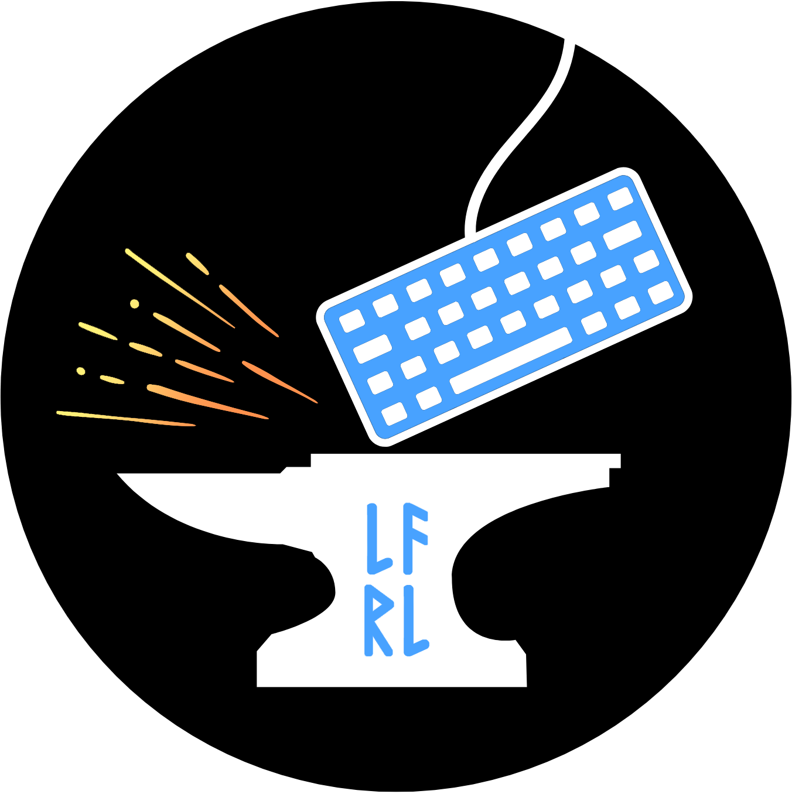

([root](https://github.com/CalionVarduk/LfrlAnvil/blob/main/readme.md))
[](https://www.nuget.org/packages/LfrlAnvil.Reactive.Queues/)

# [](../../../../assets/logo.png) [LfrlAnvil.Reactive.Queues](https://github.com/CalionVarduk/LfrlAnvil/tree/main/src/LfrlAnvil.Reactive/LfrlAnvil.Reactive.Queues)

This project contains a few functionalities related to event queues.

### Documentation

Technical documentation can be found [here](https://calionvarduk.github.io/LfrlAnvil/api/LfrlAnvil.Reactive.Queues/LfrlAnvil.Reactive.Queues.html).

### Examples

Following is an example of an event queue:
```csharp
// represents a datetime-related event queue with events of 'string' type
public class EventQueue : EventQueueBase<string, DateTime, TimeSpan>
{
    public EventQueue(DateTime startPoint)
        : base( startPoint ) { }

    protected override DateTime AddDelta(DateTime point, TimeSpan delta)
    {
        return point + delta;
    }
}

// creates a new event queue with its start point equal to now
var start = DateTime.Now;
var queue = new EventQueue( start );

// enqueues a single 'foo' event that should be dequeued at 'start + 2 minutes'
queue.Enqueue(
    "foo",
    delta: TimeSpan.FromMinutes( 2 ) );

// enqueues three 'bar' events that should be dequeued at:
// 1. 'start + 1 minute'
// 2. 'start + 6 minutes'
// 3. 'start + 11 minutes'
queue.EnqueueAt(
    "bar",
    dequeuePoint: start + TimeSpan.FromMinutes( 1 ),
    delta: TimeSpan.FromMinutes( 5 ),
    repetitions: 3 );

// enqueues an infinite number of 'qux' events that should be dequeued at:
// 1. 'start + 4 minutes'
// 2. 'start + 8 minutes'
// 3. 'start + 12 minutes'
// 4. 'start + 16 minutes'
// etc.
queue.EnqueueInfinite(
    "qux",
    delta: TimeSpan.FromMinutes( 4 ) );

// moves the queue forward by '7 minutes'
queue.Move( TimeSpan.FromMinutes( 7 ) );

// dequeues all pending events
for ( var e = queue.Dequeue(); e is not null; e = queue.Dequeue() )
    Console.WriteLine( $"Event: '{e.Value.Event}', Offset: {e.Value.DequeuePoint - start}" );

// expected console output:
// Event: 'bar', Offset: 00:01:00
// Event: 'foo', Offset: 00:02:00
// Event: 'qux', Offset: 00:04:00
// Event: 'bar', Offset: 00:06:00

// moves the queue forward by '10 minutes', to 'start + 17 minutes' point
queue.Move( TimeSpan.FromMinutes( 10 ) );

// dequeues all pending events
for ( var e = queue.Dequeue(); e is not null; e = queue.Dequeue() )
    Console.WriteLine( $"Event: '{e.Value.Event}', Offset: {e.Value.DequeuePoint - start}" );

// expected console output:
// Event: 'qux', Offset: 00:08:00
// Event: 'bar', Offset: 00:11:00
// Event: 'qux', Offset: 00:12:00
// Event: 'qux', Offset: 00:16:00
```

There also exists an event queue version that allows to re-organize registered events.

Following is an example of an event stream based on an event queue:
```csharp
// creates a new event stream based on an event queue with its start point equal to now
var start = DateTime.Now;
var source = QueueEventSource.Create( new EventQueue( start ) );

// attaches a listener to the event stream
source.Listen(
    EventListener.Create<FromQueue<string, DateTime, TimeSpan>>(
        e => Console.WriteLine( $"Event: '{e.Enqueued.Event}', Offset: {e.Enqueued.DequeuePoint - start}" ) ) );

// enqueues a single 'foo' event that should be dequeued at 'start + 2 minutes'
source.Queue.Enqueue(
    "foo",
    delta: TimeSpan.FromMinutes( 2 ) );

// enqueues three 'bar' events that should be dequeued at:
// 1. 'start + 1 minute'
// 2. 'start + 6 minutes'
// 3. 'start + 11 minutes'
source.Queue.EnqueueAt(
    "bar",
    dequeuePoint: start + TimeSpan.FromMinutes( 1 ),
    delta: TimeSpan.FromMinutes( 5 ),
    repetitions: 3 );

// enqueues an infinite number of 'qux' events that should be dequeued at:
// 1. 'start + 4 minutes'
// 2. 'start + 8 minutes'
// 3. 'start + 12 minutes'
// 4. 'start + 16 minutes'
// etc.
source.Queue.EnqueueInfinite(
    "qux",
    delta: TimeSpan.FromMinutes( 4 ) );

// moves the event stream forward by '7 minutes'
source.Move( TimeSpan.FromMinutes( 7 ) );

// expected console output:
// Event: 'bar', Offset: 00:01:00
// Event: 'foo', Offset: 00:02:00
// Event: 'qux', Offset: 00:04:00
// Event: 'bar', Offset: 00:06:00

// moves the event stream forward by '10 minutes', to 'start + 17 minutes' point
source.Move( TimeSpan.FromMinutes( 10 ) );

// expected console output:
// Event: 'qux', Offset: 00:08:00
// Event: 'bar', Offset: 00:11:00
// Event: 'qux', Offset: 00:12:00
// Event: 'qux', Offset: 00:16:00
```
